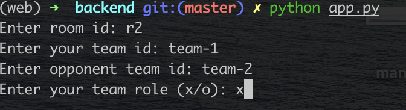
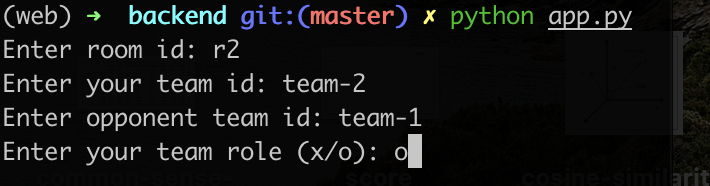

# Trò chơi Tic-Tac-Toe AI với Minimax và Cắt tỉa Alpha-Beta

## Giới thiệu
Đây là một triển khai trò chơi Tic-Tac-Toe bằng Python với đối thủ AI sử dụng thuật toán Minimax kết hợp với Cắt tỉa Alpha-Beta để tối ưu hóa. AI được thiết kế để đưa ra các nước đi tối ưu, tạo ra một đối thủ đầy thách thức.

## Tính năng
- Chơi Tic-Tac-Toe với đối thủ AI.
- AI sử dụng thuật toán Minimax với Cắt tỉa Alpha-Beta để xác định nước đi tốt nhất một cách hiệu quả.
- Hỗ trợ chế độ người chơi vs AI và AI vs AI.

## Cách hoạt động của AI
AI đưa ra quyết định bằng thuật toán Minimax kết hợp với Cắt tỉa Alpha-Beta:
1. **Thuật toán Minimax**: Đánh giá đệ quy tất cả các trạng thái trò chơi có thể và chọn nước đi tối ưu.
2. **Cắt tỉa Alpha-Beta**: Giảm số lượng nút cần đánh giá trong thuật toán Minimax, giúp tối ưu hóa hiệu suất.
3. **Một số cải tiến khác để nhằm giảm thời gian tính toán của thuật toán**
Chi tiết báo cáo: https://drive.google.com/file/d/1cX-fCOkPsZaDjsS85olJXwFEnvSzhihU/view?usp=drive_link

# Hướng dẫn chạy
1. Chạy trọng tài 
2. Lấy link trọng tài để chạy Backend và Frontend
3. Chạy Frontend 
4. Chạy Backend
5. Cách chạy cụ thể được hướng dẫn trong file README của referee, backend và frontend

# Cách chạy Backend

1. Vào thư mục /backend
2. cài đặt môi trường  `pip install -r requirements.txt`
3. Chạy `python app.py`
4. Điền thông tin phòng và 2 đội chơi

